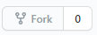
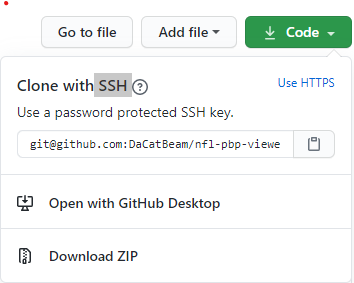
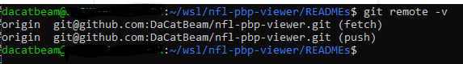

## Setup
1) Navigate to the repo and click 'Fork'

2) Navigate to your fork (it will probably redirect you [there](https://github.com/distraughtiana/nfl-pbp-viewer))

3) Copy the git@git.... link
* Make sure you choose the SSH option, otherwise you'll be prompted for user name and password w/ every push

4) Navigate to whatever folder you want to store the repo in and run:
* `$ git clone git@github.com:distraughtiana/nfl-pbp-viewer.git`

5) Run: `$ git branch` you should see: dev

6) Run: `$ git remote -v`

* You should see your fetch and push

7) Run: `$ git remote add upstream git@github.com:DaCatBeam/nfl-pbp-viewer.git`

* This will allow you to pull code from the master repository to update your own fork.

8) Run: `$ git remote -v` again and you should see a new remote named 'upstream'

9) When creating a new branch you'll run:
* `$ git checkout -b <new_branch_name>`
* This will create a new branch and switch over to it.
* We'll start a convention of using the Jira Issue Key as our branch names. And prepend commit messages with it as well. This will make coding tasks more tracable and provide observability to project managers. It also has the added benefit of making breaking changes or defects easier to find and remove from the code base.
* Example: My branch is named: `NFLPBP-2`

